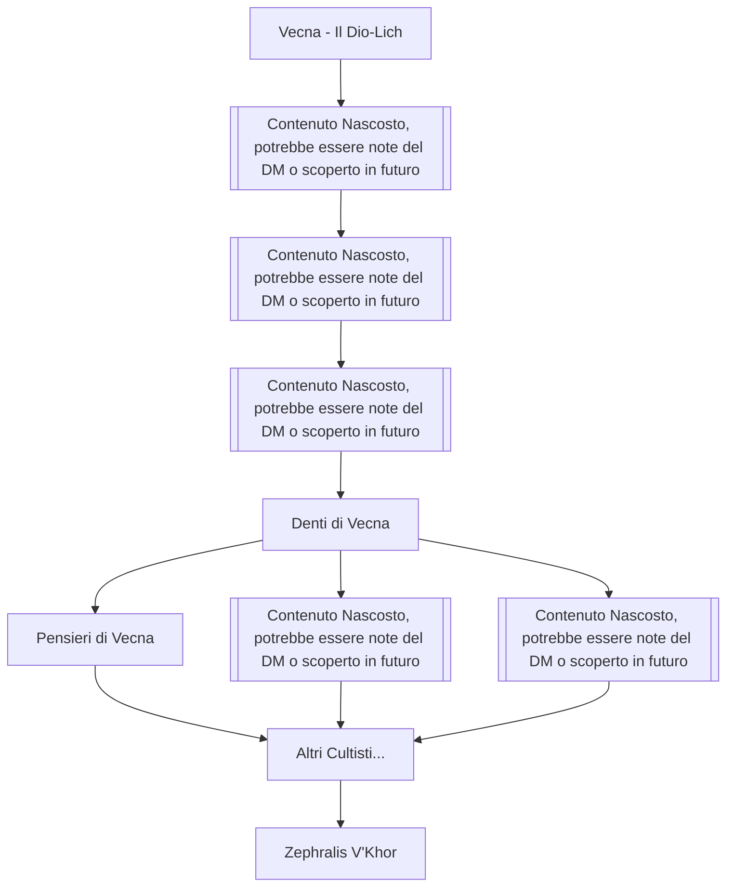

---
{"dg-publish":true,"permalink":"/2-informations/organization/il-culto-di-vecna/","noteIcon":""}
---

## Descrizione
Il Culto di [[greyhawk-vecna \| Vecna]] è un'organizzazione segreta e blasfema dedicata al culto del Dio-Lich della Conoscenza Segreta e della Non-Morte. Operando nell'ombra per secoli, il culto cerca di accumulare conoscenze proibite, segreti arcani e potere necrotico per servire il loro maestro immortale e portare la sua volontà nel mondo materiale.

Il culto è noto per i suoi rituali macabri, l'uso di magie necromatiche avanzate e la ricerca ossessiva di artefatti legati a Vecna, in particolare i leggendari **Occhio** e **Mano di Vecna**. I membri del culto sono fanatici devoti che vedono la morte come una transizione verso un potere superiore sotto la guida del loro signore non-morto.

Recentemente, il culto ha intensificato le sue attività a [[2-Informations/Locations/Neverwinter\|Neverwinter]], orchestrando una serie di rapimenti mirati di nobili e studiosi per scopi ancora da svelare completamente.

---

## Struttura Gerarchica

---

## I Ranghi del Culto

|Rango|Ruolo Principale|Simbolo|Poteri e Responsabilità|
|---|---|---|---|
|[Contenuto Nascosto, potrebbe essere note del DM o scoperto in futuro]|[Contenuto Nascosto, potrebbe essere note del DM o scoperto in futuro]|[Contenuto Nascosto, potrebbe essere note del DM o scoperto in futuro]|[Contenuto Nascosto, potrebbe essere note del DM o scoperto in futuro]|
|[Contenuto Nascosto, potrebbe essere note del DM o scoperto in futuro]|[Contenuto Nascosto, potrebbe essere note del DM o scoperto in futuro]|[Contenuto Nascosto, potrebbe essere note del DM o scoperto in futuro]|[Contenuto Nascosto, potrebbe essere note del DM o scoperto in futuro]|
|[Contenuto Nascosto, potrebbe essere note del DM o scoperto in futuro]|[Contenuto Nascosto, potrebbe essere note del DM o scoperto in futuro]|[Contenuto Nascosto, potrebbe essere note del DM o scoperto in futuro]|[Contenuto Nascosto, potrebbe essere note del DM o scoperto in futuro]|
|Denti di Vecna|Maghi e Incantatori|🦷 Zanne|Utilizzatori di magia necrotica e arcana|
|Pensieri di Vecna|Sacerdoti e Maghi Minori|🧠 Cervello|Guidano le cellule individuali chiamate Organi|
|[Contenuto Nascosto, potrebbe essere note del DM o scoperto in futuro]|[Contenuto Nascosto, potrebbe essere note del DM o scoperto in futuro]|[Contenuto Nascosto, potrebbe essere note del DM o scoperto in futuro]|[Contenuto Nascosto, potrebbe essere note del DM o scoperto in futuro]|
|[Contenuto Nascosto, potrebbe essere note del DM o scoperto in futuro]|[Contenuto Nascosto, potrebbe essere note del DM o scoperto in futuro]|[Contenuto Nascosto, potrebbe essere note del DM o scoperto in futuro]|[Contenuto Nascosto, potrebbe essere note del DM o scoperto in futuro]|

> [!info]- Simbolismo Anatomico
> Ogni rango rappresenta una parte del corpo di Vecna, enfatizzando come il culto sia un unico organismo vivente (o non-morto) che serve la volontà del Dio-Lich.

---

## Dottrina e Credenze

### **Principi Fondamentali**
- **La Conoscenza è Potere**: I segreti valgono più dell'oro e devono essere custoditi gelosamente
- **La Morte è Illusione**: La non-morte rappresenta l'evoluzione superiore dell'esistenza
- **Il Segreto Supremo**: Vecna possiede la conoscenza finale che porterà il dominio assoluto
- **La Trasformazione**: Solo attraverso la servitù a Vecna si può raggiungere la vera immortalità

### **Rituali Sacri**
- **Rituali di Iniziazione**: [Contenuto Nascosto, potrebbe essere note del DM o scoperto in futuro]
- **Cerimonie della Mano**: Autolesionismo rituale che comporta l'amputazione volontaria per il mantenimento dei segreti
- **Sacrifici di Conoscenza**: Eliminazione di testimoni per preservare segreti del culto

---

## Operazioni Attuali

### **I Rapimenti di Neverwinter**
Il culto ha orchestrato il rapimento strategico di quattro nobili di spicco:

- **[[2-Informations/NPCS/Neverwinter/Nobili Rapiti/Eldon Vegliachiavi\|Eldon Vegliachiavi]]** - Studioso dei piani esterni (per le sue conoscenze sulle "Fenditure Crepuscolari")
- **[[2-Informations/NPCS/Neverwinter/Nobili Rapiti/Gilbert Noblin\|Gilbert Noblin]]** - Storico delle divinità (per il suo Magnum Opus sui segreti divini)
- **[[2-Informations/NPCS/Neverwinter/Nobili Rapiti/Indrina Lamsensettle\|Indrina Lamsensettle]]** - Attrice famosa (scopo ancora sconosciuto)
- **[[2-Informations/NPCS/Neverwinter/Nobili Rapiti/Sarcelle Malinosh\|Sarcelle Malinosh]]** - Stregona esploratrice (per i suoi poteri di viaggio planare)

## Membri Noti

### **Denti di Vecna**
- **Oxtu** - Cultista di alto rango con tendenze autoritarie, residente nella base segreta
- Altri due Cultisti nella base di cui non avete mai saputo il nome
- **[[2-Informations/NPCS/Hallix Forge/Eryndor Tempus\|Eryndor Tempus]]** - Mago temporale catturato dagli avventurieri durante l'infiltrazione

### **Sangue di Vecna**  
- **Valthar** - Guardia d'élite, ucciso durante la battaglia nella forgia

### **Membri particolari**
- **[[2-Informations/NPCS/Hallix Forge/Zephralis V'Khor\|Zephralis V'Khor]]** - Fabbro corrotto, creatore della lama [[2-Informations/Items/Sete di Sangue\|Sete di Sangue]] e di coltelli rituali

### **Membri Comuni**
- Diversi **[[3-Mechanics/CLI/bestiary/undead/wight\|wight]]** controllati magicamente come guardiani
- **Ricordi di Vecna** - Cultisti di basso rango che eseguono compiti operativi

---

## Artefatti e Creazioni

### **Armi Maledette**
- **[[2-Informations/Items/Sete di Sangue\|Sete di Sangue]]** - Spada creata da [[2-Informations/NPCS/Hallix Forge/Zephralis V'Khor\|Zephralis V'Khor]], che torna al creatore quando completa il suo scopo
- **Coltelli Rituali** - Lame con rune necromatiche che si dissolvono dopo l'uso, utilizzate per suicidi di emergenza

## Nemici e Oppositori

### **L'Agenzia**
- **[[2-Informations/Players/Katrin(Ange)\|Katrin(Ange)]]** parte della missione originale contro il culto
- **[[2-Informations/Players/Kenshin di Atami(Pie)\|Kenshin di Atami(Pie)]]** possiede un'arma creata dal culto ma ne è diventato nemico

### **Autorità di Neverwinter**
- **[[2-Informations/NPCS/Neverwinter/Lord Neverember\|Lord Neverember]]** ha combattuto il culto per anni senza successo
- **[[2-Informations/Players/Sedda(Andrea)\|Sedda(Andrea)]]** ha raccolto intelligence sul culto per lungo tempo
- Le **Spie Reali** monitorano costantemente le attività sospette

---

> [!warning] Attenzione
> Il Culto di Vecna rappresenta una minaccia esistenziale non solo per Neverwinter, ma potenzialmente per tutto Faerûn. La loro ricerca di conoscenze proibite e il collegamento diretto con Vecna li rendono estremamente pericolosi.

> [!cite] Motto del Culto
> _"Nel segreto troviamo la forza, nella morte troviamo la vita eterna, in Vecna troviamo la verità finale."_
> 
> "_Gloria all'immortale!_"