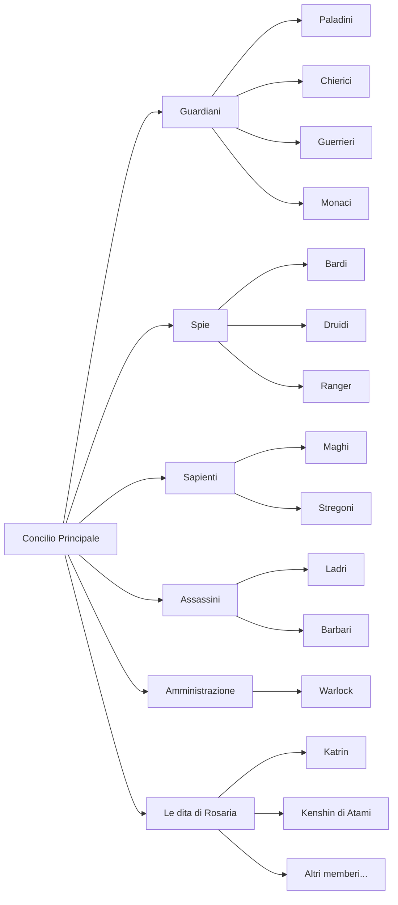

---
{"dg-publish":true,"permalink":"/2-informations/organization/l-agenzia/","noteIcon":""}
---

## Descrizione
L'agenzia è un'organizzazione segreta nata come orfanotrofio di copertura, dove i membri vengono cresciuti e addestrati fin da bambini per diventare agenti letali e versatili. Opera in Faerûn con una struttura complessa, suddivisa in cinque rami principali, ciascuno con funzioni specializzate e simbolismo distintivo.

Fondata circa 25-30 anni fa, ha una reputazione solida e un alto grado di segretezza. [[2-Informations/Players/Katrin(Ange)\|Katrin(Ange)]], uno dei suoi membri più importanti, ne rappresenta un esempio di successo, essendo cresciuta nell'organizzazione e rifiutando il comando per seguire la propria strada.

Entrato da poco nell'agenzia ce anche [[2-Informations/Players/Kenshin di Atami(Pie)\|Kenshin di Atami(Pie)]], con referenza di [[2-Informations/Players/Katrin(Ange)\|Katrin(Ange)]]

---

## Struttura Generale

Il potere è condiviso tra i leader dei cinque rami, che formano il Concilio senza un capo unico.

---

## I 5 Rami dell’Agenzia

| Ramo          | Ruolo Principale                          | Simbolo        | Note                             |
|---------------|-----------------------------------------|----------------|---------------------------------|
| Guardiani     | Protezione e scorta di VIP               | 🛡️ Scudo       | Paladini e guardie personali    |
| Spie          | Raccolta informazioni e sorveglianza    | 👁️ Occhio      | Infiltrazioni, controspionaggio |
| Sapienti      | Strategia, gestione conoscenze e archivi| 📚 Libro       | Analisti, ricercatori           |
| Assassini     | Eliminazioni mirate                      | 🔪 Pugnale     | Professionisti dell’omicidio    |
| Amministrazione| Gestione risorse, logistica e coperture | 👑 Corona      | Coordinamento e facciate legali |
> [!note] Le Dita di Rosaria
> Le dita sono un gruppo speciale di Assalto fatto apposta per [[2-Informations/Players/Katrin(Ange)\|Katrin(Ange)]] che non si interessa degli altri gruppi dell'agenzia
> In seguito anche [[2-Informations/Players/Kenshin di Atami(Pie)\|Kenshin di Atami(Pie)]] è venuto a farne parte

---

## Reclutamento

- Il reclutamento avviene principalmente attraverso l’orfanotrofio segreto gestito da:
  - **“Mamma Tiffani”**: figura materna amorevole  
  - **“Papà”**: addestratore fisico duro ed esigente  
- Addestramento precoce in camuffamento, assassinio silenzioso, copertura e abilità sociali  
- [[2-Informations/Players/Katrin(Ange)\|Katrin(Ange)]] è un esempio di membro di alto rango, con una squadra speciale affidatale dal Concilio  
- [[2-Informations/Players/Kenshin di Atami(Pie)\|Kenshin di Atami(Pie)]] invece è un esempio di entrata tramite referenza (Anche se è partito dal basso uguale)
- La struttura conta circa 25 corporati (agenti esperti)  
- Possibilità di lavori personali limitati quando non impegnati in missioni ufficiali  

---

## Membri conosciuti

- [[2-Informations/Players/Katrin(Ange)\|Katrin(Ange)]]
- [[2-Informations/Players/Kenshin di Atami(Pie)\|Kenshin di Atami(Pie)]]

---

## Imprese e Operazioni Notevoli

- **Politica:** eliminazioni camuffate e manipolazioni elettorali  
- **Intelligence:** rete capillare per raccogliere informazioni sensibili  
- **Protezione:** scorte VIP spesso camuffate da paladini  
- **Eliminazioni:** assassinii “puliti” con occultamento di prove  
- **Amministrazione:** facciate legali, logistica e coordinamento  
- Collaborazioni con Lord Neverember e interventi contro il culto di Vecna  
- Katrin ha ottenuto poteri magici e gioca un ruolo cruciale nelle operazioni segrete  

---
